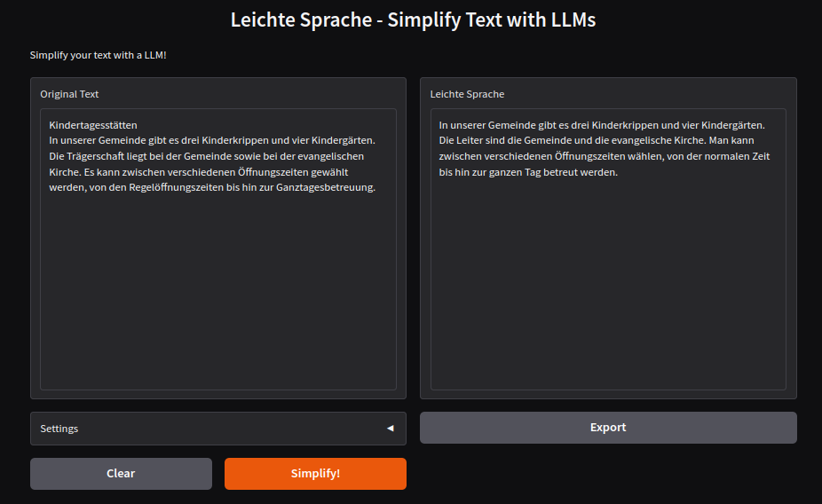

[](https://hpi.de/en/research/hpi-data-center/ai-service-center/)

# Leichte Sprache

## Simplify German language!

Locally-run tool to simplify German into "Leichte Sprache" (easy language) based on Large Language Models (LLMs).



The browser interface is designed for intuitive use, allowing experimentation with different models and approaches. The implementation focuses on simplicity, low-level components and modularity, allowing developers and Python enthusiasts to modify and build upon.

### Installation

#### Install the basic tool

Download or clone the repository.

Follow the [installation instructions](docs/installation.md)

---

### Usage

- Start the tool [*]

```shell
$ python3 app.py
```

- Open the provided URL on your web browser
- Write or paste a text to simplify
- Enjoy

### Key Settings

- **Model**: Select the desired [Model](docs/info_models_versions.md)
- **Use Rules** (checkbox): Click for adding Leichte Sprache rules to the prompt sent to the LLM. 

#### Additional Input parameters for the LLMs

- Top k: Ranks the output tokens in descending order of probability, selects the first k tokens to create a new distribution, and it samples the output from it. Higher values result in more diverse answers, and lower values will produce more conservative answers.

- Temp: This affects the “randomness” of the answers  by scaling the probability distribution of the output elements. Increasing the temperature will make the model answer more creatively.

---

[*] If you chose the installation with a virtual environment, remember to activate it before starting the application by running ```$ source .myvenv/bin/activate```

Performance consideration: On notebooks/PCs with dedicated GPUs, all the  set models should run properly and fast. On a standard notebook,  or if you encounter any memory of performance issues, prioritize the models based on llama 3.2 as they are smaller than the models based on llama 3.1 and need less hardware requirements.

---

## Extra Tools

 There are additional [command line input tools](docs/extra_tools.md) that you can use to batch process data.

---

## Development

Before committing, format the code using Black:

```shell
$ black -t py311 -S -l 99 .
```

Linters:

- Pylance
- flake8 (args: --max-line-length=100 --extend-ignore=E401,E501,E741)


For more detailed logging, set the `LOG_LEVEL` environment variable:

```shell
$ export LOG_LEVEL='DEBUG'
```
---

## License

[GPLv3](./LICENSE)
